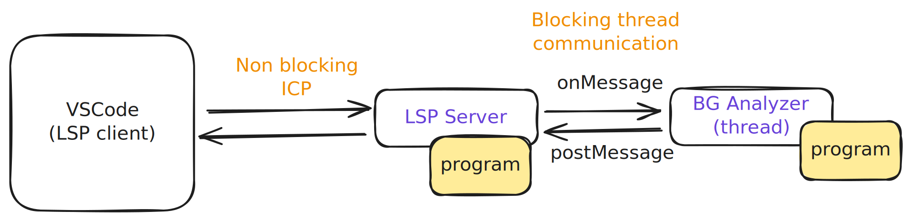
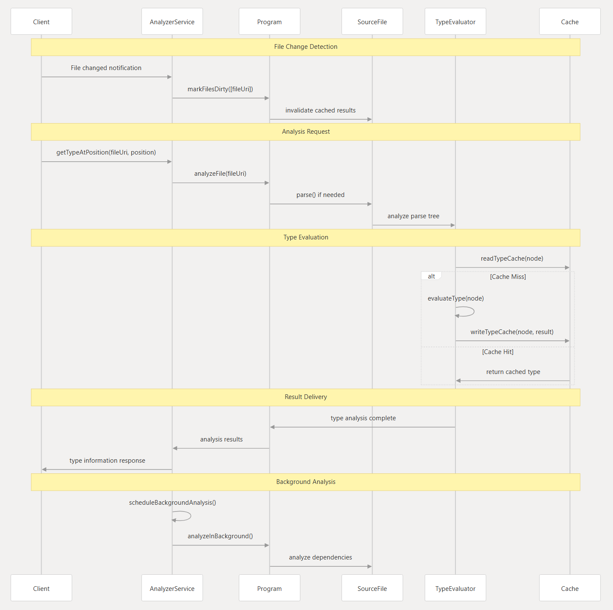

# Pyright Reverse Engineering

  
Pyright is a static type checker for Python, developed by Microsoft. It is designed to provide fast and accurate type checking, making it a valuable tool for Python developers who want to ensure code quality and maintainability.

## Architecture Overview

- The pyright LSP is a different process, communicate with the LSP client (vscode) using ICP and, the two threads are communicating with node internal communication protocol (syncronously).

- The pyright LSP has two components:
    - **foreground thread**: it has a `program` instance
    - **background thread**: it has another copy of the `program` instance they both are in sync to maintain the same state [^1]
    - The reason for having two instances is to make the LSP responsive, so that the background thread can do the heavy lifting of analyzing the code without blocking the main thread.

- The background thread will only do the diagnostic work and send the analysis result to the foreground thread, and thats when we can see the red squiggles in the editor. Other tasks are run in both foreground and background program instances to maintain the same state and it's important to have a forground instance to make the LSP responsive.
    - The diagnostics will send from the worker thread serialized and the main theads will deserialize it and update the state of the program instance [^2].

## System Architecture

The architecture diagram is from [https://deepwiki.com/microsoft/pyright](https://deepwiki.com/microsoft/pyright)

[^1]: pyright\packages\pyright-internal\src\backgroundAnalysisBase.ts

[^2]: pyright\packages\pyright-internal\src\backgroundAnalysisBase.ts:308